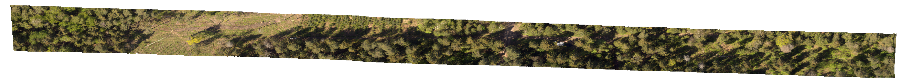
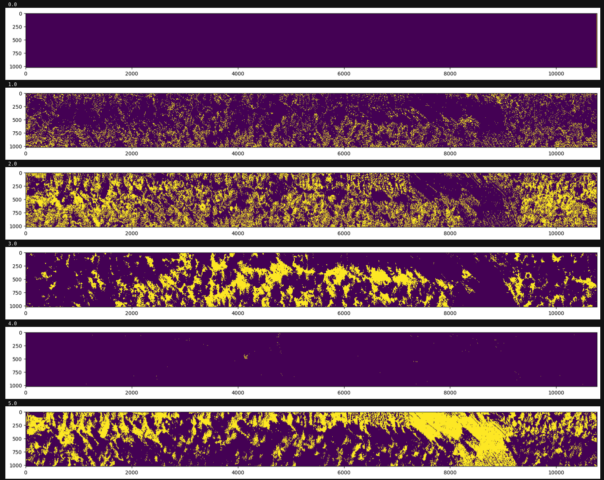

# Hyperspectral Data Automated Clustering Using Convolutional Autoencoders

## How to run

Install python packages from requirements.txt into virtualenv or other environment.

Run using:

`python3 clustering.py  --cube "path/to/hyperspectral/cube"  --out "path/to/output/folder"`

Hyperspectral cube has to be envi compatible raster file. 

## Parameter adjustment

Model parameters are provided in parameters.py file (and the parameters_example.py file as default parameter set).

Changes in parameters need to be made in the parameters.py file. Adjust according to requirements and datasets used.

Parameters used:

```
"num_clusters" - The cluster number to find
"inshape" - shape of the part of hyperspectral image, sugested square shape with all spectral bands (224 with our Specim data). 
"kernel" - kernel must be smaller than the inshape. 
"n_epochs" - training epochs
"update_interval" - number of training batches between the clustering distribution recalculation (used for optimization since it takes a lot of time to calculate, possible rewrite of kmeans to GPU might help).
"gamma" - clustering loss multiplier.
"batch_size" - nuber of inshape parts to use at the same time for training
"LR" - optimizer learning rate
"weight_decay" - optimizer weight decay
"latent_space" - clustering AE latent space size
"filters" - clustering AE convolution filter size (keep around the number of clusters, but depends on the datasets used)
"smoothing" - to use SAVGOL spectral smoothing for training and predictions or not.
```

## Output/Results

Numpy integer array of the same size as image with each pixel having the predicted cluster number.

RGB image input:



Clustering output:

